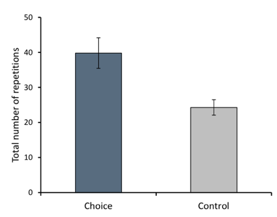

# Theoretical Bases
> If someone asked us 'but is that true?' we might say "yes" to him; and if he demanded grounds we might say "I can't give you any grounds, but if you learn more you too will think the same." - Ludwig Wittgenstein, On Certainty, Line 206.

If you’re reading this part of the book, then you are either really super-excited about this stuff and you want to learn more, or you are coming into the Appendix with pitch forks and torches to try and figure out a way to prove me wrong. Either way you’re here to answer a question: _Is this true?_

Researchers have been studying behavior change for a very long time and for a lot longer than the 5 years that I have been immersed in it. And as much as humanity has learned from this work, and as much as we can say there are certainly some theories that we can reliably use to make predictions and whose axioms are pretty damn close to fact, I need you to know something very important before you read this Appendix: 

**Science is a verb. It’s something a community does and the noun is a body of evidence that comes from the doing of it.**

The theories explored in this Appendix are the result of that verb and a framework for how we can learn more of the evidence that we need to make better, more accurate predictions relevant to our work. They are not “Truth.” They are not inherently more or less ethical, and there will always be doubt. So let’s get comfortable with those words and discuss around the doubt to what we mean by “evidence.”
### Evidence-backed
To my mind, when a practitioner claims that his or her methods are “backed by evidence,” I expect to see a randomized control trial with that exact protocol done on the exact population with whom that practitioner is working. This is often demanded of practitioners to be “ethical” and that’s just dumb. This is so high a bar that even medicine struggles to clear it. It’s also a silly bar because it’s not even how science works. Random control trials are just one way to test hypotheses and one that sacrifices a lot of external validity for internal validity. Same with meta-analyses, longitudinal studies, etc. Everything has tradeoffs and _what matters for certainty is not the discovery of truth but the slow elimination of doubt._
### Evidence-based
In the way that I view the world, evidence-based is a lower bar for validity, but a realistic bar for the application of evidence when working with people. “Evidence-based” means you are making decisions based on something more than your intuition. Based on more than personal anecdote or your own collection of cognitive biases (which we all have). _Evidence-based means you are not just working to eliminate your own doubt, but the doubts of like-minded people in your profession, and outsiders looking in._ It is not ethical a priori, but defendable. It means that if you are called before a jury of strangers, you could defend your decisions on what to do with a client under a cross-examination of your peers. 

When it comes to ethics, I personally hold myself to a virtue standard rather than a defendable or “rule-based” standard. I care about looking in a mirror as much as a jury of my peers, but I consider defendable to be the lowest acceptable professional standard. And here’s an example:

For weight loss clients, daily weigh-ins are evidence-based. Hell, they’ve been done in studies so many times they might be evidence-backed! But I don’t do daily weigh-ins. I don’t even do weekly and for some clients I don’t even do monthly weigh-ins. They are evidence-based, but that doesn’t make them practical or ethical. I’ve seen too many clients fall to pieces and quit over a wonky weigh-in with no context. I’ve seen far more harm than good. So even though there have been more studies with more participants than my 1000 clients, I choose not to do them. The evidence does not meet my personal standard for eliminating the doubt that I am doing harm.

This is my ethical framework as you read about the theories in this appendix. I can defend every decision in this document, but some of them I might just have to say, “I can't give you any grounds, but if you learn more you too will think the same.”

## Ego-Depletion
> “Acts of self-control draw from a common, global resource. The resource is limited and vulnerable to becoming depleted over time, just as a muscle becomes tired after a period of exertion” Hagger, Wood, Stiff, & Chatzisarantis, 2010, pg. 496.

Your client was totally going to eat a salad for dinner, but they said, “screw it” and got a Big Mac. They were going to go the gym five days this week, but were exhausted by Tuesday and slept in. They walked by the M&M jar at work 3 times, but on trips 4-10 they grabbed a few handfuls.

As much as many of our clients think otherwise, these are not “moral lapses.” They are classic examples of what Baumeister, Bratslavsky, Muraven, and Tice first described as “ego-depletion” or the observed phenomenon that resisting temptation has a mental cost[^1]. And they are a fact of life. Drs. Baumeister and Tice have lead a generation of researchers into studying this new “Strength Model” of willpower which has held up quite well under meta-analysis[^2] and even crept into popular science journalism [^3]. And while there is still healthy debate on what substance is actually being “spent” and what mental processes are doing the spending [^4], the phenomenon of “ego-depletion,” of mentally “running out of gas” has been quite well established.

Why the Strength Model matters to Intentional Communities has more to do with the potential modifiers of that phenomenon than the phenomenon itself. It appears that the perception of ego-depletion can be modified by a number of factors like beliefs about self-control[^5], feedback about available resources[^6], getting interrupted while performing ego-depleting tasks[^7], and how deliberative or automatic the behavior is[^8]. Which makes Intentional Communities a perfect breeding ground for “strengthening” willpower. The experience that most people have trying something alone is usually trying to do too much, losing focus, and giving up before any of their behavior became automatic. But putting people together with a common mission means they are now seeing one another succeed a little each day, staying focused on the things that matter, and performing a variety of tasks frequently enough within context to become habitual. In short, working together means we are less likely to feel like we’re “running out of gas” and more likely to form habits.

## Habit-Formation
> “Habits arise from context–response learning that is acquired slowly with experience.” Wood & Neal, 2007, pg. 844.

Habits might be the most powerful and misunderstood forces in psychology, even by educated people who are out there promoting “habit-based coaching.” And the reason that habits are so powerful is “because the impetus for responding is outsourced to contextual cues, habit performance does not depend on the finite self-control resources required for more deliberative actions[^9].” Essentially habits don’t induce ego-depletion. They don’t use up willpower! But most popular habit-formation programs take a lot of willpower. Way more than I think coaches even appreciate. The result is that I think habits are getting a bad rep because many well-meaning coaches think they are promoting habit formation when they are really just burning through their clients’ willpower in a novel way. Intentional Communities can fix that.

### What’s a Habit?
Put simply, habits are the built-in tendency for our brains to repeat the stuff they’ve done before[^10]. Habits are a type of brain function that we identify by tell-tale features, the most obvious being frequency. Most people understand habits as actions that you perform a whole lot. Things you do every day like brushing your teeth, making coffee in the morning, or changing into a cardigan and sneakers when you get home from work to play with your puppet collection, but there’s more to habits than frequency.

According to Verplanken (2006), “habit should not be equated with frequency of occurrence, but rather should be considered as a mental construct involving features of automaticity, such as lack of awareness, difficulty to control and mental efficiency[^11].” So when we use the word “habit,” we shouldn’t just think about “frequent” but also “automatic.” Habits are the stuff we do almost entirely on autopilot. They take little to no effort. In fact, they often crop up when we are exerting effort on other things. Like when you are driving while thinking really hard about something else and find yourself accidentally taking a left turn to go to the office instead of the grocery store. Coincidentally this is called habit intrusion[^12] and is a great example of how even complicated, coordinated actions involving lots of moving parts (driving is hella complicated) can be cued up and performed without exerting effort, or without us even knowing we are doing it.

Another feature of habits is that they are “cued” or “triggered” by context[^13]. This means that something in our environment flicks the domino and all the actions necessary for a habit just start falling into place. Like being at that corner that you turn left at 5 days a week to go to the office. However, we don't always know what that trigger is; in fact, we rarely do. We are usually just relying on post-hoc rationalizations[^14]. But triggering, whether we know the actual trigger or not, is a defining feature of habits. 

These features: frequent, automatic, context specific, and largely below our level of conscious awareness, means hitting “off” (or hitting snooze) on your alarm clock is a pretty perfect example of a habit. I bet sometimes you don’t even remember doing it!

### What’s Wrong With Most Popular Habit Interventions
There are many popular interventions like B.J. Fogg’s Tiny Habits, Leo Babauta’s Sea Change, and a lot of people are familiar with Charles Duhigg’s “habit loop,[^15]” which is an evidence-based intervention for forming new habits that goes, “trigger, action, reward.” And while these interventions can work, they suffer from the same problem: they confuse their tools (small, daily process goals aka “intentions”) with what they are trying to build (automatic behavior, aka “habits”), and they place too much client focus on the action instead of the total context.

Asking clients to set small daily process goals (“intentions”) to be done after a specific triggering event is a fantastic tool. Habitry, Co. teaches coaches to do this for our tailored group training protocols. Smaller daily intentions use less willpower (but not none), provide for lots of little wins, improve self-efficacy (see below) and lots of other benefits. But alone, these protocols are rarely sustainable. Ask people how long they did Tiny Habits and keep in mind that it takes 18-254 days for individual intentions to become habitual [^16]. “Individual efforts to control habit cuing upstream of a behavior potentially suffer the drawbacks of lack of sustainability, preoccupied thinking, and ironic effects found with active inhibition[^17].” 

Additionally, most “healthy habits” that our clients and we desire (like going to the gym or choosing nutrient-dense foods), no matter how frequently you do them, can never be purely habitual because they are complicated combinations of actions that take place in so many different contexts that they will always take planning and effort[^18]. _Your clients are never going to go to the gym, workout, and come home to realize they’re covered in sweat and can’t remember how they got that way._ 

What we need to focus on instead, and what Intentional Communities allow us to do, is put our clients in a new context. One with new triggers and rewards. And one that effects the other 55% of their daily brain activity that is not automatic[^19], while their intentions eventually become habitual.

### Dual-Process Model
We’ve known for a very long time that habits aren’t the only neurological game in town. You can’t explain all the richness of human thinking as either being all unconscious and automatic (like a robot) or all conscious and deliberative (like a pondering philosopher). But we’ve been researching both of these explanations for the way people think separately for generations[^20]. It’s not been until quite recently that have researchers have been combining the observations of these two ways of thinking into a single working theory[^21]. A “dual-process theory” that takes into account both nonautomatic and automatic thinking. Both the conscious and unconscious. Both deciding, planning, then executing on a desire to eat popcorn; and mindlessly shoving stale kernels into your face[^22].

“Dual-Process” means there are two ways that the brain can perform any part of any action: either consciously or unconsciously. You can look down at the keyboard and think very hard about deliberately spelling out each word letter by letter, or you can look ahead at the screen and type by touch at 100 words per minute. But if you think about the process of typing, it’s not that simple is it? Sometimes you need to look down to see what you’re typing. Sometimes you need to think really hard about how a word is spelled and look at the keyboard to find the letters. Sometimes you’re exhausted and hangry and you totally forget where the damn “X” is for like 2 whole minutes. And if you’re typing on a Dvorak keyboard, you might as well be learning from scratch.

The important thing to know about the Dual-Process Model, as I hope I’ve shown with the typing example, is that there is very little that is pure habit or purely planned. Everything we engage in lies on a spectrum that is constantly changing based on our environment, goals, available willpower, self-efficacy, motivation, and a myriad of other factors. We can eat lots of colorful vegetables for months without really trying, then one day notice that you haven't eaten a green thing all week. Young parents often watch every cleaning and personal hygiene habit they’ve developed over their adult lives crumble in the wake of a few dozen sleepless nights. The point I’m trying to make is that the stuff we call “healthy habits” are complex and always subject to changes in environment. They will always take effort. _And the goal isn’t to make target behaviors effortless, but easier._ And Intentional Communities make it easier by getting people into a new context.

### Change the Context, Then the Action
The easiest way to change habitual behavior is to put someone in a completely new environment [^23]. And while that is a lofty and impractical goal for most behavior change interventions, Intentional Communities do provide people with a new social environment. New people with whom they share a mission, values, and a common identity. These changes in personal connections can serve as a disruption to other habits, like self-doubt, and poor self-talk, as well as provide them with new rewards like hearing from 39 other people how awesome it was that they ate kale. “If people are best able to act on their goals when related habits are disrupted, then it is during these times that people’s overt responses are most likely to be vulnerable to change through persuasive messages and other informational interventions.[^24]”

As I said in the introduction, habits are amazing, powerful tools but if all you’re focused on is habits, you’re missing the bigger picture. _Telling people to do a small thing everyday is not habit-formation. It’s just a novel way of telling people to do shit._ Change the context. Then change the actions.

## Social Cognitive Theory
> “Learning would be exceedingly laborious… if people had to rely solely on the effects of their own actions to inform them what to do. _Fortunately, most human behavior is learned observationally through modeling_: from observing others one forms an idea of how new behaviors are performed” - (Bandura, 1997)

How did you learn to smile? How did you learn to walk? How did you learn what is “right” and “wrong?” According to Albert Bandura and one of the most influential theories in social science, you learned by watching the people around you. Bandura, a developmental psychologist at Stanford, did a number of famous experiments with children in the 1960s who watched adults play with an inflatable doll called a “Bobo Doll.” From these “Bobo Doll Experiments,” Bandura developed a number of models throughout the 1970’s and 1980’s that coalesced after more experiments into “Social Cognitive Theory,” which proposes that personal (self-efficacy), behavioral (outcome expectancies like rewards and punishment), and environmental (physical and social context) factors interact with one another to produce learned behavior. So we learn by watching and mimicking others (modeling), seeing what happens when we do (outcome expectancies), which informs our individual belief that we can successfully perform a behavior (self-efficacy). Bringing people to learn together in groups not only provides lots of opportunities to watch other people, but it also provides a crucial cauldron for creating a lot of self-efficacy really fast. And understanding how to harness self-efficacy is more important than just about any other force that makes Intentional Communities so wildly successful.

### Self-Efficacy
Bandura defines self-efficacy as, “people's beliefs about their capabilities to produce designated levels of performance that exercise influence over events that affect their lives.[^25]” or more simply, “how confident I am I can do something.” Self-Efficacy is not global like “confidence” or moral like “self-esteem.” Self-Efficacy is how confident we are that we can do a specific task and get a specific outcome. Self-Efficacy is at the core of behavior change. Why would anyone waste valuable time, money, and the potential for embarrassment and self-worth trying to perform an action to achieve a goal if they were not confident that they could perform that action and that in doing so, would achieve that goal?

Let me give you two ways to make $10,000:

“I have invented a computer program that no one in the world has ever beaten at the game of Strategema. If you beat it, I’ll give you $10,000”

Vs.

“I have a 10 question math test that 99% of people get perfect scores on. Everyone I’ve talked to thinks you’ll ace it. If you get a perfect score, I’ll give you $10,000.”

Which of these appeals to you? Hopefully the second because Strategema is a made up game from season 2 of Star Trek: The Next Generation that looks really hard. And here’s the thing, almost everyone will pick #2 because according to Social Cognitive Theory, humans assess how likely we will be able to do something based on 4 important factors:
1. Personal Experience: “Have I done this before?”
2. Vicarious Experience: “Well if that person like me can do it, I can do it.”
3. Social Persuasion: “These people cheering me on seem to think I can do it, so I bet I can.”
4. Physiological Factors: “What’s my body telling me? Are those butterflies in my stomach good or bad?”
Now put yourself in the position of your clients. There’s this crazy thing called, “diet and exercise” that they’ve heard might help them reach their goals. But everything they've done hasn’t worked (that’s why they came to you), they probably don’t have a lot of people in their lives whom they can model their behavior on, there’s probably not many people telling them they can do it, and whenever they try it hurts. That’s not exactly the best recipe for self-efficacy. But what happens when you put them into a group of other people like them who are trying to learn how to integrate changes to diet and exercise into their lives and trying to actually do it? 

- They get some small successes (past experience)
- They see others like them succeed (vicarious experience)
- They get encouragement and support (social persuasion)
- They start to learn more about what their body is telling them (physiological factors)

Suddenly the simple fact of being surrounded by other people on their journey gives them people to model, manages their expectations, and is now teaching them self-efficacy. There is now a “New Normal” of what is possible and the coach doesn’t have to do a thing.

## Self-Determination Theory
> “Don’t ask ‘how can I motivate other people.” That’s the wrong way to think about it. Instead ask, ‘_how can I create the conditions within which other people will motivate themselves._’” - Ed Deci, PhD, Co-Founder of Self-Determination Theory

For decades, people thought of motivation as a quality that varied only in amount. How much do I want that slice of pizza? How little do I want to work out? But in the 1970s, Ed Deci, PhD. and Richard Ryan, PhD. began to tease out motivation as not only something that varied in amount, but also in quality. Why do I want that slice of pizza? Why do I not want to workout? At first they found that motivation could be categorized as “intrinsic,” because we want to, and “extrinsic,” because others are incentivizing us. But this was just the tip of the motivational iceberg. 

After 40 years and tens of thousands of experiments and papers by scientists from all over the world, Self-Determination Theory (SDT)[^26] has proven to be the most powerful framework for understanding why humans do what we do and what practitioners can do to improve the likelihood that people will feel motivated. According to SDT, people feel the most motivated when they feel like their “Basic Psychological Needs” are being supported (or at least not being thwarted). By being in conditions where these Basic Psychological Needs, autonomy, competence and relatedness to others (aka “belonging), are fostered our motivation quality and quantity improves and we are more likely to keep performing a task, and that task is more likely to become a part of our identity as well to form habits that make the competition of that task easier.

We’ve probably all experienced a “motivational climate” like this at some point and considered it a high-time in our lives. When we were acting accordance with our values, obviously improving, and surrounded by support and encouragement. We might remember it as a great coach, an excellent teacher, or an awesome team. Autonomy, competence and belonging are universal psychological needs and fostering them is one of the most powerful forces that an Intentional Community can harness. 

### Autonomy
Imagine instead of reading this, I was presenting it to you as a lecture. We have just gotten to a pause and since you’re standing right next to the coffee cart, I ask you, “would you mind getting me a cup of coffee?” If you are a nice person and my lecture was decent, you probably wouldn’t mind turning around and pouring me a cup. But what if I’d said, “get me a cup of coffee.” 

Did that make the hair on the back of your next stand up a bit? Did you think, “fuck you; get your own damn coffee!” 

The difference between those two statements is one recognizes autonomy, our “universal urge to be causal agents, to experience volition, to act in accord with [our] integrated sense of self (i.e. their interests and values).[^27]” This is an important and technical definition that many people misunderstand when they hear about the role of autonomy in Self-Determination Theory. Fostering Autonomy is not, “letting them do whatever you feel like in the moment,” “avoiding structure,” or even, “anti-authority.” As Deci and Vansteenkiste (2004) put it, “to be autonomous does not mean to be independent of others, but rather it means to feel a sense of willingness and choice when acting, whether the actions are independently initiated or are in response to a request from significant others.[^28]”

A lot of people I’ve talked to find it hard to jive “autonomy” and “community,” which is why the distinction Deci and Vansteenkiste make is very important. It is perfectly possible to act in accordance with our identity and values while being a part of a group since a lot of how we define ourselves is by how we relate to others. I consider myself a kind, generous person and take pride in my desire to help other people. It feels good when I do things for others (like getting coffee) and I feel like I am acting in accordance with my values. Autonomy can manifest as the joy in going out of your way for a spouse. The pleasure one gets from chipping in for your team. Or the pride that one gets for doing one's duty for God or Country.

**Autonomy is the feeling you get when you do what you think the best version of yourself would do.**

And as you can see from these examples, we can recognize people’s need to feel autonomous while we ask them to do something that they might not intrinsically want to do. In fact, it can be as simple as asking for things instead of demanding them (like coffee), asking for permission before we offer advice (“hey, would you mind if I told you what I’m thinking?”), asking what kind of nutritional habits they think would have the most impact, or even giving people choices within our programming. Researchers have showed that even something as simple as letting people choose what order to do a predetermined set of exercises in resulted in those participants performing significantly more sets and reputations of each exercise[^29].

### Competence
There are few joys in life like putting time into learning a skill and seeing yourself get better at it. Competence, also known as mastery, is at the heart of how we perceive if a pursuit is worth continuing. 

Imagine you’re trying to lose weight. It’s been a month, and you’ve lost 8lbs. Sweet! Feels pretty good to see the effort result in a positive change, doesn’t it? Now imagine it’s the end of week 5, and the scale is only down half a pound. What the fuck?! That’s 75% worse than week 1! 

How motivated do you feel? Puts the typical weight loss plateau in a whole new light, no?

The important thing to note, however, is that the Basic Psychological Need is the _perception_ of competence. Perception comes up a lot in social psychology. We want to feel like we’re getting better at what we’re doing and as a result human beings are feedback monsters. We are constantly looking for the answer to the question, “how am I doing? Am I getting better? Is this worth it?” And we will find by comparing ourselves to others (competition), to a defined standard (“The AMA says typical weight loss is between 1-2lbs per week”), what a coach says (“you’re doing great! I see plateaus like this all the time!”), and how people are doing around us (“oh, you guys have plateaus, too?”). 

When we go it alone, we often struggle in a feedback vacuum, desperate for anything we can interpret as an answer to the question, “how am I doing?” And because we are beginners when we start something new, we are usually really bad at knowing where to look for that feedback. By surrounding people with others who on the same journey, Intentional Communities solve the feedback vacuum problem. So instead of wondering where to look, we have potentially hundreds of people telling us what feedback matters, and what feedback we can ignore (like a plateau in scale weight). 

### Belonging
It should be pretty obvious that Intentional Communities would foster a sense of belonging in members. But what is not obvious to many people is that belonging is important even to people who pursue and practice activities alone. Think of the runners you know who go on long, solo runs, then talk about how awesome it was with their runner friends. Or the people who work out every day by themselves, then check in at the gym on Facebook or post pics on Instagram. Just because people do things alone does not mean they aren’t seeking the Basic Psychological Need of belonging, they just want to control when and how they get that sense of belonging. Researchers found that people who choose to spend time on their own report higher levels of perceived belonging and lower levels of loneliness than people who are forced to spend time with other people[^30]. What matters is autonomy; getting to choose whether we engage to our level of comfort. We all need to feel like we are connected with each other, even the introverted. Heck, even the Unabomber wrote letters to his brother from his cabin in Montana.

When I saw Ed Deci present on the state of Self-Determination Theory research at the American Association of Sport Psychology conference in 2014, Dr. Deci put a slide up with that single sentence, “Self-determined motivational environments are better.” And he said, “that single sentence is the result of 10,000 studies on motivation.” That’s some powerful evidence. Supporting people’s Basic Psychological Needs of autonomy, competence, and belonging is simply and unequivocally better[^31]. Better for health outcomes[^32]; better for learning movement[^33]; better for vitality, well-being, and mortality in old age[^34]; better across cultures[^35]; even better for sport performance[^36]. At that talk, Dr. Deci summarized how practitioners like us can use this knowledge by asking ourselves a single question: _how can we create the conditions in which people feel safe to motivate themselves?_

## Achievement Goal Theory
> “A mastery-oriented motivational climate tends to promote hard work, effort, co-operation, and personal development among individuals acting in that climate” Hagger & Chatzisarantis, 2008, pg. 92.

While people in the motivation world were busy at work on Self-Determination Theory, the education and sport psychology worlds were cooking up research that showed the impact of different kinds of goals on motivation and performance. As the theories co-evolved, the concepts of “motivational climate” began to appear both Self-Determination Theory and Achievement Goal Theory[^37].

### Mastery Motivational Climate
In Achievement Goal Theory there are (broadly) two overarching kinds of motivational climates: Mastery and Performance. A mastery-oriented motivational climate is one where people are focused on getting better at a task (process goals) rather than the overall outcome or to impress others. A performance-oriented motivational climate is one where the emphasis is placed on outcomes and beating others. The superiority of a mastery motivational climate (what Carol Dweck calls a “learning orientation” or “growth mindset[^38]”) has been clear for decades in multiple meta-analyses[^39] and longitudinal studies[^40] for the motor development, over-all mental health, and well-being of the participants[^41], as well as the adoption of lifetime physical activity habits[^42].

## The Transtheroetical Model and Stages of Change
The most widely accepted framework for understanding how people change their behavior is the TTM[^43]. The TTM outlines 6 stages of change. 

1. Pre-contemplation – “Shut up, I’m all good.”
2. Contemplation – “OK, maybe I’m not all good.”
3. Preparation – “Yeah, I’m thinking about getting better soon.”
4. Action – “I’m doing something I need to do to get better, dammit.”
5. Maintenance – “I’m better, but still working at it.”
6. Termination – “I’m pretty good and man, was I fooling myself back then.”

The TTM was developed out of an addiction model and has proven a pretty popular framework for developing addiction interventions. And let’s be real: one of the reasons I think the TTM is so popular is that it feels right. We can hear clients saying these things. It’s very descriptive of a phenomenon that a lot of coaches can point to: “some people are just not ready to change.”

But the model has come under fire in recent years for a number of reasons[^44], not the least of which a lack of longitudinal studies[^45] and the failure for TTM-based interventions to do better than chance in reviews and meta-analyses in smoking cessation[^46], diabetes management[^47], physical activity[^48], and across multiple health interventions[^49]. 

Prochaska has defended the model vigorously[^50], contributed many Randomized Control Trials to the literature[^51], and more longitudinal studies have been completed[^52], but it’s getting hard to ignore the weight of evidence that things might just be more complicated than Prochaska has outlined in his 6 stages of change.

Intentional Communities allow for those complications. As stated in earlier sections, creating a “flat circle” where engagement can ebb and flow with low barriers to entry honors people’s need cycle between stages of change multiple times before eventually moving through them.

## Theory of Planned Behavior
The concept of a “new normal” can best be encapsulated in Icek Ajzen’s Theory of Planned Behavior (TPB)[^53], a Social Cognitive-based extension of the Theory of Reasoned Action [^54] that relies heavily self-efficacy to explain modifiers to intention. Ajzen noticed pretty quickly into his research into Reasoned Action, that people did not always act in accordance with their intention. So Ajzen and many other researchers ran experiments and discovered some other perceived barriers between intention and action. The TPB is a hierarchy of those barriers to planned action broken down into  “attitude toward the behavior,” “subjective norm,” and “perceived behavioral control.” Meta-analyses have been conducted for TPB-based interventions for physical activity[^55] and health outcomes[^56]. The area that Intentional Communities have the largest effect is on the Subjective Norm.

### Subjective Norm
The subjective norm an individual's perception about a particular behavior as is influenced by the judgment of how other people in their lives view that behavior. If none of your friends smoke, you’re less likely to view smoking as cool. If all of your friends are exercising and eating kale, you’re far more likely to see exercising and eating kale as normal. And Intentional Community is a way of “tipping the scale” in favor of moving individuals’ subjective norms towards healthier behavior.

## References
Adams, J., & White, M. (2005). Why don't stage-based activity promotion interventions work?. _Health education research, 20_(2), 237-243. [Link](http://her.oxfordjournals.org/content/20/2/237.full)

Ames, C. (1992). Classrooms: Goals, structures, and student motivation. _Journal of educational psychology, 84_(3), 261. [Link](http://www.unco.edu/cebs/psychology/kevinpugh/motivation_project/resources/ames92.pdf)

Ariely, D., Huber, J., & Wertenbroch, K. (2005). When do losses loom larger than gains?. _Journal of Marketing Research, 42_(2), 134-138. [Link](http://people.duke.edu/~dandan/Papers/Other/LA_comment.pdf)

Ariely, D., & Wertenbroch, K. (2002). Procrastination, deadlines, and performance: Self-control by precommitment. _Psychological science, 13_(3), 219-224. [Link](http://dl1.cuni.cz/pluginfile.php/95343/mod_resource/content/0/Ariely_2002_procrastination.pdf)

Ariely D., & Davidson, C. (2013). Course Description for The Proof is in the Pudding: A Course on Social Proof. Duke University. [Link](sites.duke.edu/english390-5_01_s2013/finalprojects/social-proof/).

Ajzen, I. (1991). The theory of planned behavior. _Organizational behavior and human decision processes, 50_(2), 179-211. [Link](http://xa.yimg.com/kq/groups/78997509/701520272/name/Oct+19+Cited+%231+Manage+THE+THEORY+OF+PLANNED+BEHAVIOR.pdf)

Ajzen, I., & Fishbein, M. (1977). Attitude-behavior relations: A theoretical analysis and review of empirical research. _Psychological bulletin, 84_(5), 888. [Link](www.thecre.com/tpsac/wp-content/uploads/2011/02/Appendix2_AttitudevsAction_ByAjzenFishbein1977.pdf)

Armitage, C. J., & Conner, M. (2001). Efficacy of the theory of planned behaviour: A meta‐analytic review. _British journal of social psychology, 40_(4), 471-499. [Link](http://www.researchgate.net/profile/Mark_Conner/publication/227533335_Efficacy_of_the_Theory_of_Planned_Behaviour_A_metaanalytic_review/links/00463513f63948370f000000.pdf)

Bandura, A. (1977). Self-efficacy: toward a unifying theory of behavioral change. _Psychological review, 84_(2), 191. [Link](citeseerx.ist.psu.edu/viewdoc/download?doi=10.1.1.315.4567&rep=rep1&type=pdf)

Bandura, A. (1998). Health promotion from the perspective of social cognitive theory. _Psychology and health, 13_(4), 623-649. [Link](exordio.qfb.umich.mx/archivos%20pdf%20de%20trabajo%20umsnh/aphilosofia/2007/NEUROPSICOLOGIA/BanHealthPro.pdf)

Bandura, A. (1986). _Social Foundations of Thought and Action: A Social Cognitive Theory (1 edition)_. Englewood Cliffs, N.J: Prentice Hall. [Link](http://www.amazon.com/Social-Foundations-Thought-Action-Cognitive/dp/013815614X)

Bandura, A. (1994). Self-efficacy. In V. S. Ramachaudran (Ed.), _Encyclopedia of human behavior_ (Vol. 4, pp. 71-81). New York: Academic Press. (Reprinted in H. Friedman [Ed.], _Encyclopedia of mental health_. San Diego: Academic Press, 1998). [Link](www.uky.edu/~eushe2/Bandura/BanEncy.html)

Bartholomew, K. J., Ntoumanis, N., & Th⊘ gersen-Ntoumani, C. (2009). A review of controlling motivational strategies from a self-determination theory perspective: Implications for sports coaches. _International Review of Sport and Exercise Psychology, 2_(2), 215-233. [Link](eprints.bham.ac.uk/350/1/Ntoumanis_2009_International_Review_of_Sport_and_Exercise_Psychology.pdf)

Baumeister, R. F., Bratslavsky, E., Muraven, M., & Tice, D. M. (1998). Ego depletion: is the active self a limited resource?. _Journal of personality and social psychology, 74_(5), 1252. [Link](my.psychologytoday.com/files/attachments/584/baumeisteretal1998.pdf)

Bertrams, A., & Pahl, S. (2014). Ego Depletion After Social Interference. _Psychology, 5_(01), 1. [Link](http://www.scirp.org/journal/PaperDownload.aspx?paperID=41844)

Braithwaite, R., Spray, C. M., & Warburton, V. E. (2011). Motivational climate interventions in physical education: A meta-analysis. _Psychology of Sport and Exercise, 12_(6), 628-638. [Link](https://dspace.lboro.ac.uk/dspace-jspui/bitstream/2134/11345/9/Braithwaite-Spray%20PSE%202011.pdf)

Bridle, C., Riemsma, R. P., Pattenden, J., Sowden, A. J., Mather, L., Watt, I. S., & Walker, A. (2005). Systematic review of the effectiveness of health behavior interventions based on the transtheoretical model. _Psychology & Health, 20_(3), 283-301. [Link](http://www.researchgate.net/profile/Chris_Bridle/publication/33042339_Systematic_review_of_the_effectiveness_of_health_behavior_interventions_based_on_the_transtheoretical_model/links/0a85e52e1285b25faf000000.pdf)

Brocas, I., Carrillo, J. D., & Dewatripont, M. (2004). Commitment devices under self-control problems: An overview. _The Psychology of economic decisions, 2_, 49-67. [Link](http://salud.edomex.gob.mx/html../MEDICA/Psicologia%20Problemas%20de%20Autocontrol.pdf)

Brown, B. (2006). Shame resilience theory: A grounded theory study on women and shame. _Families in Society: The Journal of Contemporary Social Services, 87_(1), 43-52. [Link](http://alliance1.metapress.com/index/64TV4804T271497R.pdf)

Brown, B. (2012). _Daring Greatly: How the Courage to Be Vulnerable Transforms the Way We Live, Love, Parent, and Lead (1 edition)_. New York, NY: Gotham. [Link](www.amazon.com/dp/1592407331/)

Burke, S. M., Carron, A. V., Eys, M. A., Ntoumanis, N., & Estabrooks, P. A. (2006). Group versus individual approach? A meta-analysis of the effectiveness of interventions to promote physical activity. _Sport and Exercise Psychology Review, 2_(1), 19-35. [Link](eprints.bham.ac.uk/426/1/BurkeNtoumanisGroupIndividualApproach.pdf)

Burke, S. M., Carron, A. V., & Shapcott, K. M. (2008). Cohesion in exercise groups: an overview. _International Review of Sport and Exercise Psychology, 1_(2), 107-123. [Link](www.dsnm.univr.it/documenti/OccorrenzaIns/matdid/matdid128270.pdf)

Cahill, K., Lancaster, T., & Green, N. (2010). Stage-based interventions for smoking cessation. _Cochrane Database of Systematic Reviews, (11)_. [Link](http://www.update-software.com/BCP/WileyPDF/EN/CD004492.pdf)

Chirkov, V., Ryan, R. M., Kim, Y., & Kaplan, U. (2003). Differentiating autonomy from individualism and independence: a self-determination theory perspective on internalization of cultural orientations and well-being. _Journal of personality and social psychology, 84_(1), 97. [Link](www.researchgate.net/profile/Richard_Ryan2/publication/10958515_Differentiating_autonomy_from_individualism_and_independence_a_self-determination_theory_perspective_on_internalization_of_cultural_orientations_and_well-being/links/0fcfd513dd669d8662000000.pdf)

Chua, S. N., & Koestner, R. (2008). A self-determination theory perspective on the role of autonomy in solitary behavior. _The Journal of social psychology, 148_(5), 645-648. [Link](http://www.tandfonline.com/doi/abs/10.3200/socp.148.5.645-648)

Collins, J. (2001). _Good to Great: Why Some Companies Make the Leap...And Others Don’t (1 edition)_. New York, NY: HarperBusiness. [Link](www.amazon.com/Good-Great-Some-Companies-Others-ebook/dp/B0058DRUV6)

Cox, K. L., Burke, V., Gorely, T. J., Beilin, L. J., & Puddey, I. B. (2003). Controlled comparison of retention and adherence in home-vs center-initiated exercise interventions in women ages 40–65 years: the SWEAT study (Sedentary Women Exercise Adherence Trial). _Preventive Medicine, 36_(1), 17-29. [Link](www.researchgate.net/profile/Ian_Puddey/publication/10999335_Controlled_comparison_of_retention_and_adherence_in_home-_vs_center-initiated_exercise_interventions_in_women_ages_40-65_years_The_S.W.E.A.T._Study_(Sedentary_Women_Exercise_Adherence_Trial)/links/0046353a65f671d174000000.pdf)

Dang, J., Dewitte, S., Mao, L., Xiao, S., & Shi, Y. (2013). Adapting to an initial self-regulatory task cancels the ego depletion effect. _Consciousness and Cognition, 22_(3), 816–821. [Link](http://www.researchgate.net/profile/Junhua_Dang/publication/230757113_Adapting_to_an_initial_self-regulatory_task_cancels_the_ego_depletion_effect/links/0deec51af365d6a18e000000.pdf)

Deci, E. L., Ryan, R. M., Gagné, M., Leone, D. R., Usunov, J., & Kornazheva, B. P. (2001). Need satisfaction, motivation, and well-being in the work organizations of a former eastern bloc country: A cross-cultural study of self-determination. _Personality and social psychology bulletin, 27_(8), 930-942. [Link](www.researchgate.net/profile/Richard_Ryan2/publication/238334147_Need_Satisfaction_Motivation_and_Well-Being_in_the_Work_Organizations_of_a_Former_Eastern_Bloc_Country_A_Cross-Cultural_Study_of_Self-Determination/links/0046352cc52f6e45fb000000.pdf)

Deci, E. L., Koestner, R., & Ryan, R. M. (1999). A meta-analytic review of experiments examining the effects of extrinsic rewards on intrinsic motivation. _Psychological bulletin, 125_(6), 627. [Link](www.jwalkonline.org/docs/Grad%20Classes/Fall%2007/Org%20Psy/Cases/motivation%20articles/PERUSED/metaanalysis%20of%20extrinsic%20rewards.pdf)

Deci, E. L., & Ryan, R. M. (Eds.). (2002). _Handbook of self-determination research._ University Rochester Press. [Link](Deci,%20E.%20L.,%20&%20Ryan,%20R.%20M.%20(Eds.).%20(2002).%20Handbook%20of%20self-determination%20research.%20University%20Rochester%20Press.)

Deci, E. L., & Vansteenkiste, M. (2004). Self-determination theory and basic need satisfaction: Understanding human development in positive psychology. _Ricerche di Psichologia, 27_, 17-34. [Link](sdtheory.s3.amazonaws.com/SDT/documents/2004_DeciVansteenkiste_SDTandBasicNeedSatisfaction.pdf)

Dishman, R. K., Vandenberg, R. J., Motl, R. W., & Nigg, C. R. (2010). Using constructs of the transtheoretical model to predict classes of change in regular physical activity: a multi-ethnic longitudinal cohort study. _Annals of Behavioral Medicine, 40_(2), 150-163. [Link](http://www.ncbi.nlm.nih.gov/pmc/articles/PMC3202427/)

Dragoni, L. (2005). Understanding the emergence of state goal orientation in organizational work groups: the role of leadership and multilevel climate perceptions. _Journal of Applied Psychology, 90_(6), 1084. [Link](digitalcommons.ilr.cornell.edu/cgi/viewcontent.cgi?article=1186&context=articles)

Dweck, C. (2006). _Mindset: The New Psychology of Success._ New York: Random House. [Link](http://www.amazon.com/Mindset-The-New-Psychology-Success/dp/1400062756/ref=tmm_hrd_title_0?ie=UTF8&qid=1428432917&sr=1-1)

Edmunds, J., Ntoumanis, N., & Duda, J. L. (2008). Testing a self‐determination theory‐based teaching style intervention in the exercise domain. _European Journal of Social Psychology, 38_(2), 375-388. [Link](eprints.bham.ac.uk/354/1/Ntoumanis_2008_European_Journal_of_Social_Psychology.pdf)

Estabrooks, P. A., Smith-Ray, R. L., Almeida, F. A., Hill, J., Gonzales, M., Schreiner, P., & Van Den Berg, R. (2011). Move More: translating an efficacious group dynamics physical activity intervention into effective clinical practice. _International Journal of Sport and Exercise Psychology, 9_(1), 4-18. [Link](www.researchgate.net/profile/Renae_Smith-Ray/publication/233201454_Move_More_Translating_an_efficacious_group_dynamics_physical_activity_intervention_into_effective_clinical_practice/links/53dbeafe0cf216e4210c03b6.pdf)

Ferrand, S. (2014). Manage Risk By Building Antifragile Organizational Cultures. gothamCulture Retrieved March 31, 2015. [Link](http://www.google.com/url?sa=t&rct=j&q=&esrc=s&source=web&cd=1&cad=rja&uact=8&ved=0CB4QFjAA&url=http%3A%2F%2Fwww.gothamculture.com%2F2014%2F12%2F23%2Fmanage-risk-antifragile-cultures%2F&ei=XCgkVeSdNIScyQSD7YC4Aw&usg=AFQjCNFGrodKD-2xQaEpgas98flrBhgVNw&bvm=bv.89947451,d.aWw)

Fortier, M. S., Sweet, S. N., Tulloch, H., Blanchard, C. M., Sigal, R. J., Kenny, G. P., & Reid, R. D. (2012). Self-determination and exercise stages of change: results from the Diabetes Aerobic and Resistance Exercise trial. _Journal of health psychology, 17_(1), 87-99. [Link](http://hpq.sagepub.com/content/17/1/87.short)

Greenleaf, R. K. (1977). _Servant leadership_. New York: Paulist Press. [Link](www.american.edu/spa/leadership/application/upload/Greenleaf,%20Servant%20Leadership.pdf)

Hagger, M. S., Chatzisarantis, N. L. D., & Biddle, S. J. H. (2002). A meta-analytic review of the Theories of Reasoned Action and Planned Behavior in physical activity: predictive validity and the contribution of additional variables. _Journal of Sport & Exercise Psychology, 24_(1), 3-32. [Link](http://psycnet.apa.org/psycinfo/2002-12499-001)

Hagger, M., & Chatzisarantis, N. (2008). Self-determination theory and the psychology of exercise. _International review of sport and exercise psychology, 1_(1), 79-103. [Link](http://www.selfdeterminationtheory.org/SDT/documents/2008_HaggerChat_IRSEP.pdf)

Hooyman, A., Wulf, G., & Lewthwaite, R. (2014). Impacts of autonomy-supportive versus controlling instructional language on motor learning. _Human movement science, 36_, 190-198. [Link](faculty.unlv.edu/wpmu/gwulf/files/2014/05/Hooyman-et-al.-2014.pdf)

Hull, C. L. (1934). The concept of the habit-family hierarchy, and maze learning. Part I. _Psychological Review, 41_(1), 33. [Link](psychcentral.com/classics/Hull/Hierarchy/part1.htm)

John, D. (2013). _Intervention: Course Corrections for the Athlete and Trainer_. Aptos, CA: On Target Publications. [Link](www.amazon.com/Intervention-Course-Corrections-Athlete-Trainer/dp/1931046174)

Job, V., Dweck, C. S., & Walton, G. M. (2010). Ego Depletion—Is It All in Your Head? Implicit Theories About Willpower Affect Self-Regulation. _Psychological Science, 21_(11), 1686-1693. [Link](http://www.langleygroup.com.au/images/Job--Dweck--Walton---2010---Ego-depletion--is-it-all-in-your-head-implicit-theories-about-willpower-affect-self-regulation.pdf)

Johnson, S. S., Driskell, M. M., Johnson, J. L., Dyment, S. J., Prochaska, J. O., Prochaska, J. M. et al. (2006a). Transtheoretical model intervention for adherence to lipid-lowering drugs. _Disease Management, 9_, 102-114. [Link](http://online.liebertpub.com/doi/abs/10.1089/dis.2006.9.102)

Johnson, S. S., Paiva, A. L., Cummins, C. O., Johnson, J. L., Dyment, S. J., Wright, J. A., Prochaska, J. O., Prochaska, J. M., & Sherman, K. (2008). Transtheoretical model-based multiple behavior intervention for weight management: Effectiveness on a population basis. _Preventive Medicine, 46_, 238-246. [Link](http://www.ncbi.nlm.nih.gov/pmc/articles/pmc2327253/)

Kahn, E. B., Ramsey, L. T., Brownson, R. C., Heath, G. W., Howze, E. H., Powell, K. E., Stone, E. J., Rajab, M. W., & Corso, P. (2002). The effectiveness of interventions to increase physical activity: A systematic review. _American journal of preventive medicine, 22_(4), 73-107. [Link](www.researchgate.net/profile/Gregory_Heath/publication/238227467_The_effectiveness_of_interventions_to_increase_physical_activity/links/02e7e52e135e41105d000000.pdf)

Kassavou, A., Turner, A., & French, D. P. (2013). Do interventions to promote walking in groups increase physical activity? A meta-analysis. _International Journal of Behavioral Nutrition and Physical Activity, 10_(1), 18. [Link](http://www.biomedcentral.com/content/pdf/1479-5868-10-18.pdf)

Kasser, V. G., & Ryan, R. M. (1999). The Relation of Psychological Needs for Autonomy and Relatedness to Vitality, Well‐Being, and Mortality in a Nursing Home1. _Journal of Applied Social Psychology, 29_(5), 935-954. [Link](www.selfdeterminationtheory.org/SDT/documents/1999_KasserRyan.pdf)

Kinnafick, F. E., Thøgersen-Ntoumani, C., & Duda, J. L. (2014). Physical Activity Adoption to Adherence, Lapse, and Dropout A Self-Determination Theory Perspective. _Qualitative health research, 24_(5), 706-718. [Link](http://www.researchgate.net/profile/Cecilie_Thogersen-Ntoumani/publication/261294155_Physical_Activity_Adoption_to_Adherence_Lapse_and_Dropout_A_Self-Determination_Theory_Perspective/links/0deec5343ce0519988000000.pdf)

Lally, P., Van Jaarsveld, C. H., Potts, H. W., & Wardle, J. (2010). How are habits formed: Modelling habit formation in the real world. _European Journal of Social Psychology, 40_(6), 998-1009. [Link](http://atlantaholisticmedicine.com/docs/How%20Habits%20are%20Formed.pdf)

Lieberman, M. D. (2007). Social cognitive neuroscience: a review of core processes. _Annual review of psychology, 58_, 259-289. [Link](faculty.oxy.edu/clint/physio/article/socialcognitiveneuroscienceareview.pdf)

Littell, J. H., & Girvin, H. (2002). Stages of Change A Critique. _Behavior Modification, 26_(2), 223-273. [Link](http://bmo.sagepub.com/content/26/2/223.short)

Maurya, A. (2012). _Running Lean: Iterate from Plan A to a Plan That Works (2 edition)_. Sebastopol, CA: O’Reilly Media. [Link](www.amazon.com/Running-Lean-Iterate-Works-Series/dp/1449305172)

McCarthy, C. J., Mills, P. M., Pullen, R., Roberts, C., Silman, A., & Oldham, J. A. (2004). Supplementing a home exercise programme with a class-based exercise programme is more effective than home exercise alone in the treatment of knee osteoarthritis. _Rheumatology, 43_(7), 880-886. [Link](rheumatology.oxfordjournals.org/content/43/7/880.short)

Millington, R. (2012). _Buzzing Communities: How to Build Bigger, Better, and More Active Online Communities._ United States: FeverBee. [Link](http://www.amazon.com/Buzzing-Communities-Bigger-Better-Active/dp/0988359901/ref=sr_1_fkmr0_1?s=books&ie=UTF8&qid=1428433555&sr=1-1-fkmr0&keywords=Buzzing+Communities%3A+How+to+Build+Bigger%2C+Better%2C+and+More+Active+Online+Communities.+United+States%3A+FeverBee.)

Miller, B. W., Roberts, G. C., & Ommundsen, Y. (2004). Effect of motivational climate on sportspersonship among competitive youth male and female football players. Scandinavian Journal of Medicine & Science in Sports, 14(3), 193-202. [Link](http://www.researchgate.net/profile/Yngvar_Ommundsen/publication/8562405_Effect_of_motivational_climate_on_sportspersonship_among_competitive_youth_male_and_female_football_players/links/0046352a9a5a346156000000.pdf)

MyFitnessPal. (2014). The Rise of the Fitness Tribe. [Link](blog-cdn1.myfitnesspal.com/wp-content/uploads/2014/05/MyFitnessTribe_Ebook_interactive_FINAL.pdf)

Ntoumanis, N., & Biddle, S. J. (1999). Affect and achievement goals in physical activity: A meta‐analysis. _Scandinavian journal of medicine & science in sports, 9_(6), 315-332. [Link](http://www.researchgate.net/profile/Nikos_Ntoumanis/publication/12695574_Affect_and_achievement_goals_in_physical_activity_a_meta-analysis/links/09e4150c0d7422f176000000.pdf)

Ng, J. Y., Ntoumanis, N., Thøgersen-Ntoumani, C., Deci, E. L., Ryan, R. M., Duda, J. L., & Williams, G. C. (2012). Self-determination theory applied to health contexts a meta-analysis. _Perspectives on Psychological Science, 7_(4), 325-340. [Link](http://eprints.bham.ac.uk/1227/1/Ntoumanis_2012_Perspectives_on_Psychological_Science.pdf)

Payne, S. C., Youngcourt, S. S., & Beaubien, J. M. (2007). A meta-analytic examination of the goal orientation nomological net. _Journal of Applied Psychology, 92_(1), 128. [Link](www.aptima.net/publications/2007_Payne_Youngblood_Beaubien.pdf)

Prochaska, J. O. (2006). Moving beyond the transtheoretical model. _Addiction, 101_(6), 768-774. [Link](http://onlinelibrary.wiley.com/doi/10.1111/j.1360-0443.2006.01404.x/full)

Prochaska, J. O., & Norcross, J. C. (2002). Stages of change. In J. C. Norcross (Ed.), _Psychotherapy relationships that work_ (303-313). New York: Oxford University Press. [Link](http://www.amazon.com/Psychotherapy-Relationships-That-Work-Evidence-Based/dp/0199737207)

Reinboth, M., & Duda, J. L. (2006). Perceived motivational climate, need satisfaction and indices of well-being in team sports: A longitudinal perspective. _Psychology of Sport and Exercise, 7_(3), 269-286. [Link](http://pure-oai.bham.ac.uk/ws/files/10762163/2006_Reinboth_Duda._Perceived_Motivation_Climate.pdf)

Renjilian, D. A., Perri, M. G., Nezu, A. M., McKelvey, W. F., Shermer, R. L., & Anton, S. D. (2001). Individual versus group therapy for obesity: effects of matching participants to their treatment preferences. _Journal of consulting and clinical psychology, 69_(4), 717. [Link](psycnet.apa.org/journals/ccp/69/4/717/)

Robinson, M. D., Schmeichel, B. J., & Inzlicht, M. (2010). A Cognitive Control Perspective of Self-Control Strength and Its Depletion. _Social and Personality Psychology Compass, 4_(3), 189–200. [Link](http://citeseerx.ist.psu.edu/viewdoc/download?doi=10.1.1.352.4199&rep=rep1&type=pdf)

Rollnick, S., Miller, W. R., & Butler, C. C. (2007). _Motivational Interviewing in Health Care: Helping Patients Change Behavior (1 edition)_. New York: The Guilford Press. [Link](www.amazon.com/Motivational-Interviewing-Health-Care-Applications/dp/1593856121)

Ryan, R. M., & Deci, E. L. (2000). Self-determination theory and the facilitation of intrinsic motivation, social development, and well-being. _American psychologist, 55_(1), 68. [Link](citeseerx.ist.psu.edu/viewdoc/download?doi=10.1.1.335.6945&rep=rep1&type=pdf)

Salmela, S., Poskiparta, M., Kasila, K., Vähäsarja, K., & Vanhala, M. (2009). Transtheoretical model-based dietary interventions in primary care: a review of the evidence in diabetes. _Health education research, 24_(2), 237-252. [Link](http://her.oxfordjournals.org/content/24/2/237.full.pdf)

Sethi, R. (2009). _I Will Teach You To Be Rich (1 edition)_. New York: Workman Publishing Company. [Link](www.amazon.com/Will-Teach-You-To-Rich/dp/0761147489)

Sewall, S., Nagl, J. A., Petraeus, D. H., & Amos, J. F. (2007). _The U.S. Army/Marine Corps Counterinsurgency Field Manual (1 edition)_. Chicago: University of Chicago Press. [Link](www.amazon.com/Marine-Corps-Counterinsurgency-Field-Manual/dp/0226841510)

Su, Y. L., & Reeve, J. (2011). A meta-analysis of the effectiveness of intervention programs designed to support autonomy. _Educational Psychology Review, 23_(1), 159-188. [Link](johnmarshallreeve.org/yahoo_site_admin1/assets/docs/Su_Reeve2011.30224719.pdf)

Sutton, S. (2001). Back to the drawing board? A review of applications of the transtheoretical model to substance use. _Addiction, 96_(1), 175-186. [Link](http://www.phpc.cam.ac.uk/pcu/wp-content/files/2012/01/Paper67.pdf)

Theeboom, M., De Knop, P., & Weiss, M. R. (1995). Motivational climate, psychological responses, and motor skill development in children's sport: A field-based intervention study. _Journal of Sport & Exercise Psychology, 294-311. [Link](http://www.researchgate.net/profile/Marc_Theeboom/publication/232512566_Motivational_climate_psychological_responses_and_motor_skill_development_in_children's_sport_A_field-based_intervention_study/links/0c96052bd57685cbd8000000.pdf)

Terry, D. J., Hogg, M. A., & White, K. M. (1999). The theory of planned behaviour: Self-identity, social identity and group norms. _British Journal of Social Psychology, 38_(3), 225–244. [Link](http://onlinelibrary.wiley.com/doi/10.1348/014466699164149/abstract)

Treasure, D. C., & Robert, G. C. (2001). Students' perceptions of the motivational climate, achievement beliefs, and satisfaction in physical education. _Research Quarterly for Exercise and Sport, 72_(2), 165-175. [Link](http://www.tandfonline.com/doi/abs/10.1080/02701367.2001.10608946)

Trost, S. G., Kerr, L. M., Ward, D. S., & Pate, R. R. (2001). Physical activity and determinants of physical activity in obese and non-obese children. _International journal of obesity,_ (25), 822-9. [Link](http://www.researchgate.net/publication/11902469_Physical_activity_and_determinants_of_physical_activity_in_obese_and_non-obese_children)

Tversky, A., & Kahneman, D. (1991). Loss aversion in riskless choice: A reference-dependent model. _The quarterly journal of economics_, 1039-1061. [Link](http://qje.oxfordjournals.org/content/106/4/1039.full.pdf)

Utman, C. H. (1997). Performance effects of motivational state: A meta-analysis. _Personality and Social Psychology Review, 1_(2), 170-182. [Link](http://www.selfdeterminationtheory.org/SDT/documents/1997_Utman_PSPR.pdf)

Velicer, W. F., Redding, C. A., Sun, X., & Prochaska, J. O. (2007). Demographic variables, smoking variables, and outcome across five studies. _Health Psychology, 26,_ 278-287. [Link](http://www.researchgate.net/profile/Wayne_Velicer/publication/6330761_Demographic_variables_smoking_variables_and_outcome_across_five_studies/links/0fcfd50328c9b2df9a000000.pdf)

Verplanken, B. (2006). Beyond frequency: Habit as a mental construct. _British Journal of Social Psychology, 45_, 639–656. [Link](http://onlinelibrary.wiley.com/doi/10.1348/014466605X49122/full)

Verplanken, B., & Wood, W. (2006). Interventions to break and create consumer habits. _Journal of Public Policy & Marketing, 25_, 90–103. [Link](https://128.125.126.117/assets/sites/545/docs/Wendy_Wood_Research_Articles/Habits/Verplanken.Wood.2006_changing_and_breaking_consumer_habits.pdf)

Vohs, K. D., Baumeister, R. F., & Ciarocco, N. J. (2005). Self-regulation and self-presentation: regulatory resource depletion impairs impression management and effortful self-presentation depletes regulatory resources. _Journal of personality and social psychology, 88_(4), 632. [Link](http://citeseerx.ist.psu.edu/viewdoc/download?doi=10.1.1.186.6339&rep=rep1&type=pdf)

Wagner, C.C., Ingersoll, K.S., and contributors (2013). _Motivational interviewing in groups_. New York: Guilford Press, Inc. [Link](www.amazon.com/Motivational-Interviewing-Groups-Applications/dp/1462507921)

West, R. (2005). Time for a change: putting the Transtheoretical (Stages of Change) Model to rest. _Addiction, 100_(8), 1036-1039. [Link](http://onlinelibrary.wiley.com/doi/10.1111/j.1360-0443.2005.01139.x/full)

Wood, W., & Neal, D. T. (2007). A new look at habits and the habit-goal interface. _Psychological Review, 114_, 843–863. [Link](http://dornsife.usc.edu/assets/sites/545/docs/Wendy_Wood_Research_Articles/Habits/wood.neal.2007psychrev_a_new_look_at_habits_and_the_interface_between_habits_and_goals.pdf)

Wood, W., Quinn, J. M., & Kashy, D. A. (2002). Habits in everyday life: Thought, emotion, and action. _Journal of Personality and Social Psychology, 83_, 1281–1297. [Link](http://www-ccd.usc.edu/assets/sites/545/docs/Wendy_Wood_Research_Articles/Habits/Wood.Quinn.Kashy.2002_Habits_in_everyday_life.pdf)

Wulf, G., Freitas, H. E., & Tandy, R. D. (2014). Choosing to exercise more: Small choices increase exercise engagement. _Psychology of Sport and Exercise, 15_(3), 268-271. [Link](faculty.unlv.edu/wpmu/gwulf/files/2014/05/Wulf_Freitas_Tandy_choose_exercise_2014.pdf)

[^1]:	Baumeister, Bratslavsky, Muraven, & Tice, 1998.

[^2]:	Hagger, Wood, Stiff, & Chatzisarantis, 2010.

[^3]:	Baumeister & Tierney, 2011

[^4]:	Robinson, Schmeichel, & Inzlicht (2010); Dang, Dewitte, Mao, Xiao, & Shi (2013).

[^5]:	Job, Dweck, Walton (2010).

[^6]:	Clarkson, Hirt, Jia, & Alexander (2010).

[^7]:	Bertrams & Paul (2014).

[^8]:	Vohs, K. D., Baumeister, R. F., & Ciarocco, N. J. (2005).

[^9]:	Wood, Neal, & Drolet, 2013, pg. 959.

[^10]:	Neal, Wood, Labrecque, & Lally, 2012.

[^11]:	Verplanken, 2006, pg. 369.

[^12]:	Reason, 1979.

[^13]:	Neal et. al., 2012; Neal & Wood, 2009.

[^14]:	Nisbett & Wilson, 1977.

[^15]:	Duhigg, 2012.

[^16]:	Lally, Van Jaarsveld, Potts, & Wardle, 2010.

[^17]:	Wood & Neal, 2007, pg. 859.

[^18]:	Verplanken, 2006; Wood et al, 2002.

[^19]:	Wood, Quinn, & Kashy, 2002.

[^20]:	Dolan & Dayan, 2013.

[^21]:	Wood, Labrecque, Lin, & Runger, 2014.

[^22]:	Neal, Wood, & Quinn, 2006.

[^23]:	Verplanken & Wood, 2006.

[^24]:	Wood & Neal, 2007, pg. 859.

[^25]:	Bandura, 1994.

[^26]:	Deci & Ryan, 2002.

[^27]:	Deci and Vansteenkiste, 2004, pg. 25.

[^28]:	Deci & Vensteenkiste, 2004, pg. 25.

[^29]:	Wulf, Freitas, & Tandy, 2014.

[^30]:	Chua & Koestner, 2008.

[^31]:	Su & Reeve, 2011.

[^32]:	Ng et al., 2012.

[^33]:	Hooyman, Wulf, & Hooyman, 2014.

[^34]:	Kasser & Ryan, 1999.

[^35]:	Deci et. al, 2001; Chirkov, Ryan, Kim, & Kaplan, 2003.

[^36]:	Bartholomew, Ntoumanis, & Th⊘gersen-Ntoumani, 2009.

[^37]:	Ames, 1992.

[^38]:	Dweck, 2006.

[^39]:	Braithwaite, Spray, & Warburton, 2011; Ntoumanis & Biddle, 1999; Utman, 1997

[^40]:	Rein both & Duda, 2006.

[^41]:	Miller, Roberts, Ommundsen, 2004; Theeboom, De Knop, & Weiss, 1995.

[^42]:	Treasure & roberts, 2001; Trost, Kerr, Ward, & Pate, 2001.

[^43]:	Prochaska & Norcross, 2002.

[^44]:	Littell & Girvin, 2002; West, 2005.

[^45]:	Sutton, 2006.

[^46]:	Cahill, Lancaster, & Green, 2010.

[^47]:	Salmela et al., 2009.

[^48]:	Adams & White, 2004.

[^49]:	Bridle et al., 2005.

[^50]:	Prochska, 2006.

[^51]:	Johnson et al., 2006; Johnson et al., 2008; Velicer et al., 2007.

[^52]:	Dishman et al., 2010.

[^53]:	Ajzen, 1991.

[^54]:	Ajzen & Fishbein, 1977.

[^55]:	Hagger, Chatzisarantis, & Biddle, 2002.

[^56]:	Armitage & Conner, 2001.
